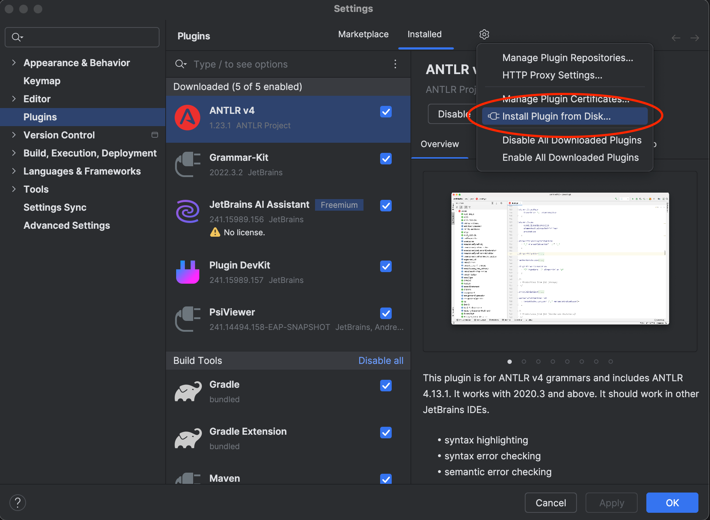
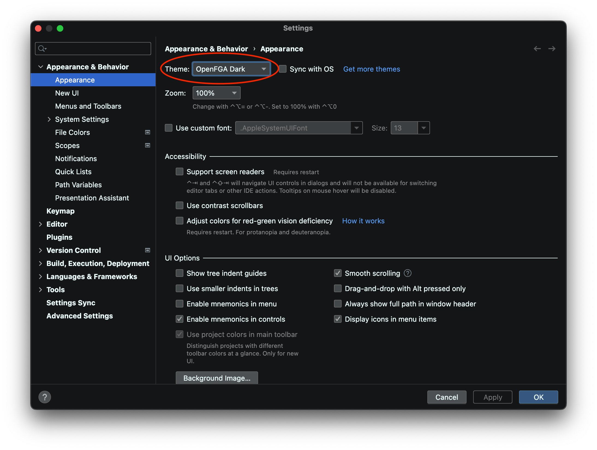
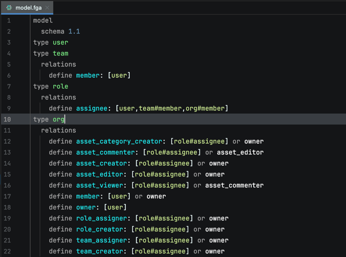
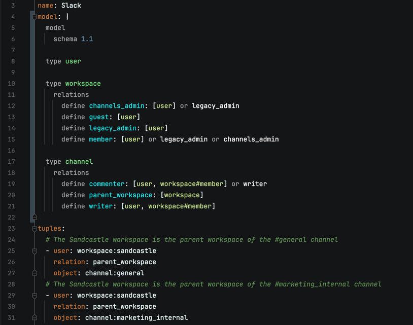
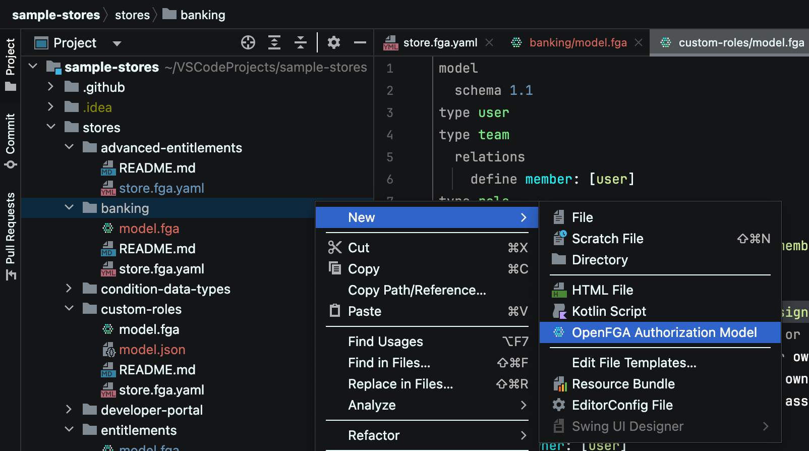
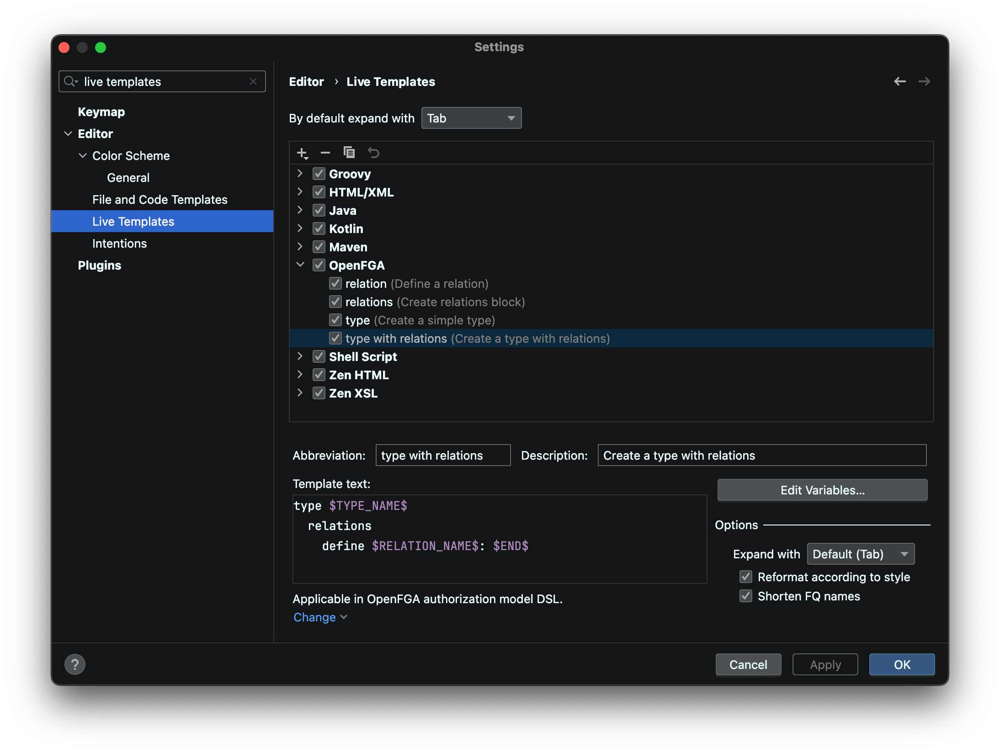
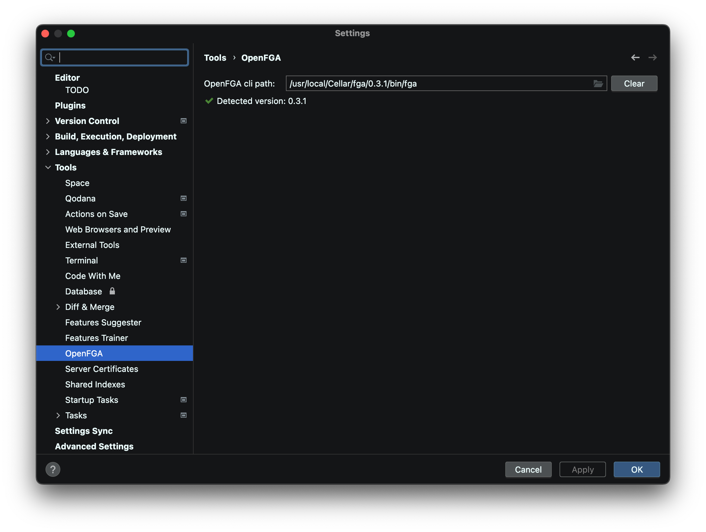
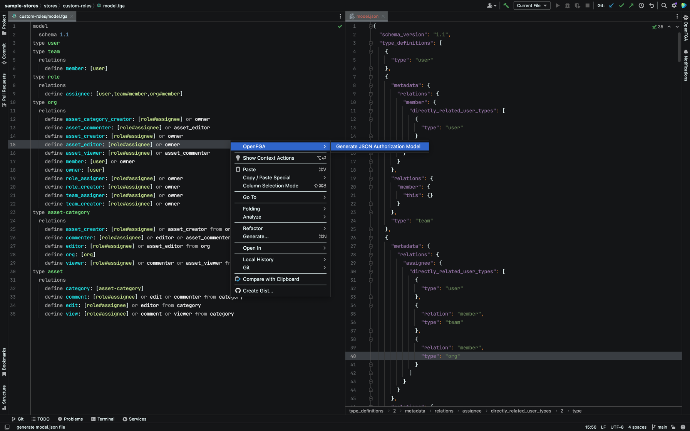
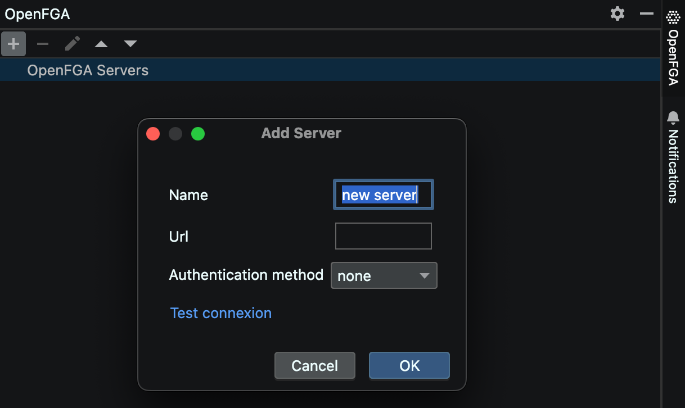

# OpenFGA plugin for JetBrain IDEs

This is the official IntelliJ plugin for [OpenFGA](https://openfga.dev/).

## About

[OpenFGA](https://openfga.dev) is an open source Fine-Grained Authorization solution inspired by [Google's Zanzibar paper](https://research.google/pubs/pub48190/). It was created by the FGA team at [Auth0](https://auth0.com) based on [Auth0 Fine-Grained Authorization (FGA)](https://fga.dev), available under [a permissive license (Apache-2)](https://github.com/openfga/rfcs/blob/main/LICENSE) and welcomes community contributions.

OpenFGA is designed to make it easy for application builders to model their permission layer, and to add and integrate fine-grained authorization into their applications. OpenFGA’s design is optimized for reliability and low latency at a high scale.

## Resources

- [OpenFGA Documentation](https://openfga.dev/docs)
- [OpenFGA API Documentation](https://openfga.dev/api/service)
- [OpenFGA on X](https://x.com/openfga)
- [OpenFGA Community](https://openfga.dev/community)
- [Zanzibar Academy](https://zanzibar.academy)
- [Google's Zanzibar Paper (2019)](https://research.google/pubs/pub48190/)

## Installation

### Manual Installation

## Usage

* IDE and Editor theme `OpenFGA Dark`

* DSL syntax support (associated with `.fga` and `.openfga` file extensions)

* DSL syntax injection for YAML store files (associated with `.fga.yaml` and `.openfga.yaml` file extensions)

* Authorization model dsl file template

* Authorization model dsl live templates

* Generate json file from DSL (requires [OpenFGA CLI](https://github.com/openfga/cli) to be installed)

* Configure servers in OpenFGA tool window

## Roadmap

A rough [roadmap](https://github.com/orgs/openfga/projects/1) for development priorities.

## Contributing

See the [DEVELOPMENT](./docs/DEVELOPMENT.md) and [CONTRIBUTING](https://github.com/openfga/.github/blob/main/CONTRIBUTING.md).

## Author

[OpenFGA](https://github.com/openfga)

## Acknowledgments

A special thanks to [Yann D'Isanto](https://github.com/le-yams) for the contribution of [their codebase](https://github.com/le-yams/openfga4intellij), which this project is built upon.

## License

This project is licensed under the Apache-2.0 license. See the [LICENSE](https://github.com/openfga/vscode-ext/blob/main/LICENSE) file for more info.
